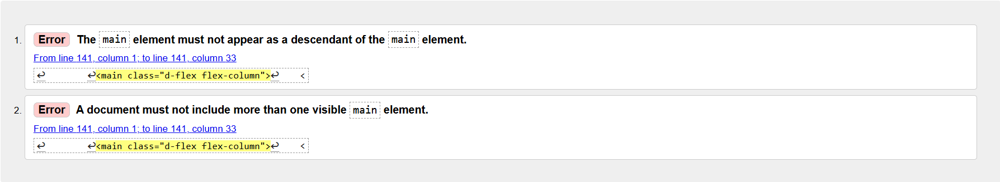
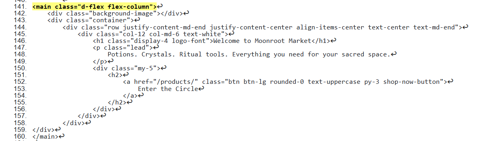
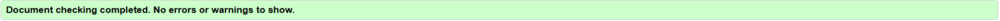
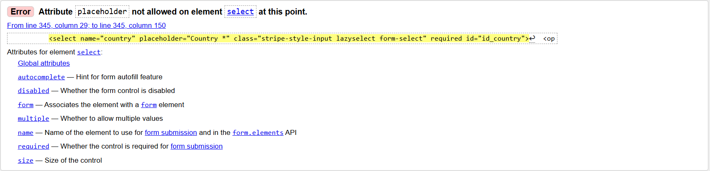

---

<h1 align="center"><strong>MOONROOT MARKET</strong>

---


## [LIVE SITE](https://moonroot-market-41ba98f58574.herokuapp.com/)

## [GITHUB RESPOSITORY](https://github.com/Angela-Sin/Moonroot_Market)

## Table of Contents

* [Manual Testing](#manual-testing)
  * [User Stories Testing](#user-stories-testing)
* [Lighthouse Testing](#lighthouse-testing)
  * [Mobile Phone](#mobile-phone)
  * [Desctop](#desctop)
* [Code Validation](#code-validation)
  * [Html](#html)
  * [CSS](#css)
  * [Python](#python)
* [Browser Compatibility](#browser-compatibility)
* [Bug-Fix](#bug-fix)


# Manual Testing
## User stories testing


| **User Story** | **Testing Method** | **Expected Outcome** | **Result** |
|---------------|-------------------|---------------------|------------|
| As a user, I want a simple navigation menu to find content easily. | Manual UI Testing | [Navigation](#common-elements-on-all-pages) is intuitive and accessible. | ✅ Pass |
| As a user, I want the navigation menu to be accessible on all devices. | Responsive Testing | [Navigation](#common-elements-on-all-pages) adjusts properly on different screen sizes. | ✅ Pass |
| As a user, I want to see social media links for community interaction. | Manual UI Testing | [Social media](#common-elements-on-all-pages) links are visible and clickable. | ✅ Pass |
| As a user, I want to register an account to access features. | Manual UI Testing | Registration form submits successfully and logs user in. |✅ Pass  |
| As a user, I want to log in and out of my account securely. | Manual UI Testing | Login and logout function correctly. |✅ Pass  |
| As a user, I want to browse products easily. | Manual UI Testing | Product listing loads correctly with accurate information. |✅ Pass  |
| As a user, I want to view detailed information about a product. | Manual UI Testing | Product detail page shows complete info including images, description, price. | ✅ Pass |
| As a user, I want to add products to my bag. | Manual UI Testing | Items can be added to the bag and quantities updated correctly. | ✅ Pass |
| As a user, I want to view my bag with all selected items and totals. | Manual UI Testing | Bag displays all items with accurate quantities and price subtotals. |✅ Pass  |
| As a user, I want to complete checkout securely. | Manual UI Testing / Automated Testing | Checkout process completes successfully with payment confirmation. |  |
| As a user, I want to receive a confirmation email after successful payment. | Email Testing | Payment success email is sent promptly with correct order details. |  ✅ Pass|
| As a user, I want to receive an authentication email after registering. | Email Testing | Registration email is sent with a working verification link. |✅ Pass  |
| As a user, I want to subscribe to newsletters or offers. | Manual UI Testing | Subscription form works and confirmation message/email is received. | ✅ Pass |
| As a user, I want to contact support easily via the contact page. | Manual UI Testing | Contact form submits successfully and sends the inquiry. |  |
| As a user, I want to read the privacy policy to understand data use. | Manual UI Testing | Privacy Policy page is accessible, readable, and contains accurate information. | ✅ Pass |
| As an admin, I want to **easily navigate the admin and site pages**, so I can manage content efficiently. | Manual UI Testing | Navigation bar and dashboard links are visible and functional. Admin can access key areas without errors. | ✅ Pass |
| As a registered admin, I want to **add products** to the site, so I can manage the catalog. | Manual UI Testing | "Add Product" button is visible. Admin can add a product through the form. Product appears in the product list. | ✅ Pass |
| As an admin, I want to **edit existing products**, so I can update product info. | Manual UI Testing | Edit buttons appear for each product. Changes made to a product are saved and reflected correctly. | ✅ Pass |
| As an admin, I want to **delete products**, so I can remove outdated or incorrect listings. | Manual UI Testing | Delete buttons are available. Product is removed after confirmation. No broken references appear. | ✅ Pass |
| As an admin, I want to **add site information** (e.g., about, FAQs), so visitors understand our purpose. | Manual UI Testing | CMS/editable content areas are accessible. Added content is displayed correctly on public pages. | ✅ Pass |
| As an admin, I want to **add new rituals**, so I can grow the rituals section. | Manual UI Testing | "Add Ritual" button is visible. Admin can create a new ritual via form, and it appears in the list. | ✅ Pass |
| As an admin, I want to **edit rituals**, so I can keep ritual details up to date. | Manual UI Testing | Each ritual has an edit option. Changes save successfully and appear correctly on the site. | ✅ Pass |
| As an admin, I want to **delete rituals**, so I can remove old or irrelevant ones. | Manual UI Testing | Delete buttons trigger a confirmation prompt. Ritual is removed from the list after deletion. | ✅ Pass |


All tests were successfully completed, ensuring a seamless user experience across all functionalities. 


- ## Responsive Navigation for Smaller Devices


# Lighthouse 
## Mobile Phone


## Desktop


# Code validation
## [Html](https://validator.w3.org/)
### Home Page


### Shopping

### Product Detail

### Bag

### Checkout

### Checkout Success


### Login

### Logout

### Register

### Day Spell

### Contact

### Rituals


# Python
## [pep8ci](#https://pep8ci.herokuapp.com/)
* Chockout


* Bag


* Contac


* Day Spell


* Profile


* Settings.py


* Webhook


# Browser Compability

The site was tested across multiple browsers for consistency and responsiveness:

| Browser           | Result  |
|------------------|--------|
| 🌍 **Google Chrome**   |   |
| 🦊 **Mozilla Firefox** |  |
| 🎭 **Microsoft Edge**  |   |
|🏴‍☠️ **Opera**            |   |


The site maintains a **consistent design** and remains **fully responsive** across different browsers.


# Bug-Fix

## ⚠️ 1-Security Notice

During the initial setup of this project, the secret key was unintentionally committed to version control. To resolve this:

- The original app was deleted.
- A new app was created with the secret key securely managed using environment variables.
- The `env.py` file is included in `.gitignore` to prevent future accidental commits.

**Important:**  
Always ensure that sensitive information like API keys, secret tokens, and credentials are stored in environment variables and never committed to the repository.

## 2-Stripe Integration Fix – jQuery and Webhook Issue

## 🧩 Problem Summary

While integrating Stripe payments, the following issues were encountered:

- Stripe elements would **not load in the browser**.
- The `$` symbol (jQuery) was **not recognized**.
- The **terminal output appeared normal**, but the browser didn’t reflect that.
- After setting up the **webhook**, the page would **freeze on order submission**:
  - No success or error messages.
  - No output in the terminal or browser console.

## 🛠️ Initial Workaround

Wrapping the code in a **loop** provided a temporary fix by making the page responsive initially.

## ✅ Final Solution

### 🔍 Root Cause

The issue was caused by the browser **not properly reading the jQuery script**, likely due to the `integrity` attribute.

### ❌ Original jQuery Script (Not Working)

```html
<script src="https://code.jquery.com/jquery-3.7.1.min.js"
        integrity="sha384-JlY8zMqb6gci8CnmUHzbqUOdD3jZP2BfIWeUE5SrZT4TgZTrZnMzI+1SWSK+3z+s"
        crossorigin="anonymous"></script>
