---

<h1 align="center"><strong>MOONROOT MARKET</strong>

---
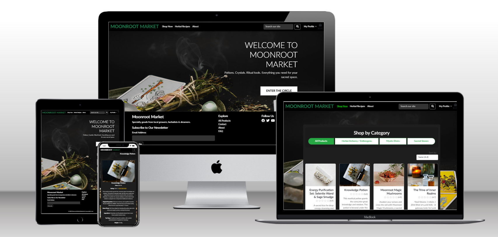


## [LIVE SITE](https://moonroot-market-41ba98f58574.herokuapp.com/)

## [GITHUB RESPOSITORY](https://github.com/Angela-Sin/Moonroot_Market)

## Table of Contents

* [Manual Testing](#manual-testing)
  * [User Stories Testing](#user-stories-testing)
* [Lighthouse Testing](#lighthouse-testing)
  * [Mobile Phone](#mobile-phone)
  * [Desctop](#desctop)
* [Code Validation](#code-validation)
  * [Html](#html)
  * [CSS](#css)
  * [Python](#python)
* [Browser Compatibility](#browser-compatibility)
* [Bug-Fix](#bug-fix)


# Manual Testing
## User stories testing


| **User Story** | **Testing Method** | **Expected Outcome** | **Result** |
|---------------|-------------------|---------------------|------------|
| As a user, I want a simple navigation menu to find content easily. | Manual UI Testing | [Navigation](#common-elements-on-all-pages) is intuitive and accessible. |  |
| As a user, I want the navigation menu to be accessible on all devices. | Responsive Testing | [Navigation](#common-elements-on-all-pages) adjusts properly on different screen sizes. |  |
| As a user, I want to see social media links for community interaction. | Manual UI Testing | [Social media](#common-elements-on-all-pages) links are visible and clickable. |  |
| As a user, I want to register an account to access features. | Manual UI Testing | Registration form submits successfully and logs user in. |  |
| As a user, I want to log in and out of my account securely. | Manual UI Testing | Login and logout function correctly. |  |
| As a user, I want to browse products easily. | Manual UI Testing | Product listing loads correctly with accurate information. |  |
| As a user, I want to view detailed information about a product. | Manual UI Testing | Product detail page shows complete info including images, description, price. |  |
| As a user, I want to add products to my bag. | Manual UI Testing | Items can be added to the bag and quantities updated correctly. |  |
| As a user, I want to view my bag with all selected items and totals. | Manual UI Testing | Bag displays all items with accurate quantities and price subtotals. |  |
| As a user, I want to complete checkout securely. | Manual UI Testing / Automated Testing | Checkout process completes successfully with payment confirmation. |  |
| As a user, I want to receive a confirmation email after successful payment. | Email Testing | Payment success email is sent promptly with correct order details. |  |
| As a user, I want to receive an authentication email after registering. | Email Testing | Registration email is sent with a working verification link. |  |
| As a user, I want to subscribe to newsletters or offers. | Manual UI Testing | Subscription form works and confirmation message/email is received. | ✅ Pass |
| As a user, I want to contact support easily via the contact page. | Manual UI Testing | Contact form submits successfully and sends the inquiry. |  |
| As a user, I want to read the privacy policy to understand data use. | Manual UI Testing | Privacy Policy page is accessible, readable, and contains accurate information. | ✅ Pass |


All tests were successfully completed, ensuring a seamless user experience across all functionalities. 


### Common Elements on All Pages

### Common Elements on All Pages
- **Navigation Bar**  
  The navigation bar provides easy and seamless access to different pages and stays fixed at the top of the page as you scroll.  
  The following links are included:
  - **Home** (Currently Active)
  - **Shop Now**
  - **Day Spell** 
  - **Rituals**
  - **Search Bar** (For quick search functionality)
    - User can search for products by entering a keyword in the search bar. The search function looks for matches in the title, summary, content, and category of products.

         - If a match is found, the relevant posts will be displayed.
         - If no keyword is entered, all posts will be shown.
  - **My Profile**
    - **Manage Product** (Only for Admin)
    - **My Profile**
    - **Logout** (If loggined)
    - **Register** (If not loginned)
    - **Login** (If not loginned)


- ## Responsive Navigation for Smaller Devices
  On tablets and smaller devices, the website uses a hamburger menu (☰) to improve navigation.

   - The menu is hidden by default and appears when the hamburger icon is clicked.
   - It includes links to Home, Shop Now, Day Spell, Rituals,, Contact and My Profile for easy access.
   - A search bar is placed below the menu, allowing users to quickly find content.

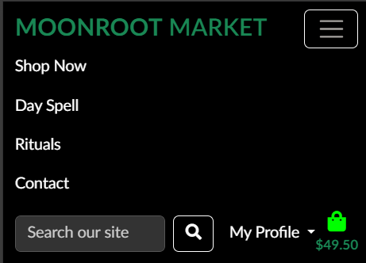

- ## Sticky Footer

The sticky footer in **Moonroot Market** is designed to stay fixed at the bottom of every page, providing users with quick access to important information and navigation links without needing to scroll.

### Contents:

- **Brand Name & Tagline**  
  Displays the site name *Moonroot Market* along with the tagline:  
  *Specialty goods from local growers, herbalists & dreamers.*  
  This highlights the market's focus on community and artisanal products.

- **Newsletter Subscription**  
  A simple subscription form prompting users to:  
  *Subscribe to Our Newsletter* with an *Email Address* input field, encouraging visitors to stay connected.

- **Explore Section**  
  Quick links to key pages:  
  - All Products  
  - Day Spell  
  - Contact  

- **Follow Us**  
  Social media links or icons allowing users to engage with the brand on various platforms.

- **Legal & Branding**  
  Includes:  
  `© 2025 Moonroot Market Privacy Policy`  
  and the phrase *Rooted in community & care.* emphasizing legal ownership and brand values.

### Purpose:

The sticky footer enhances usability by consolidating essential navigation, branding, legal information, and user engagement tools into a consistently visible area, making it easy for users to explore the site and stay connected.


- ## Responsive Navigation for Smaller Devices


# Lighthouse 
## Mobile Phone


## Desktop


# Code validation
## [Html](https://validator.w3.org/)


## CSS
## [CSS-Valitador](#https://jigsaw.w3.org/css-validator/)

# Python
## [pep8ci](#https://pep8ci.herokuapp.com/)
* Chockout

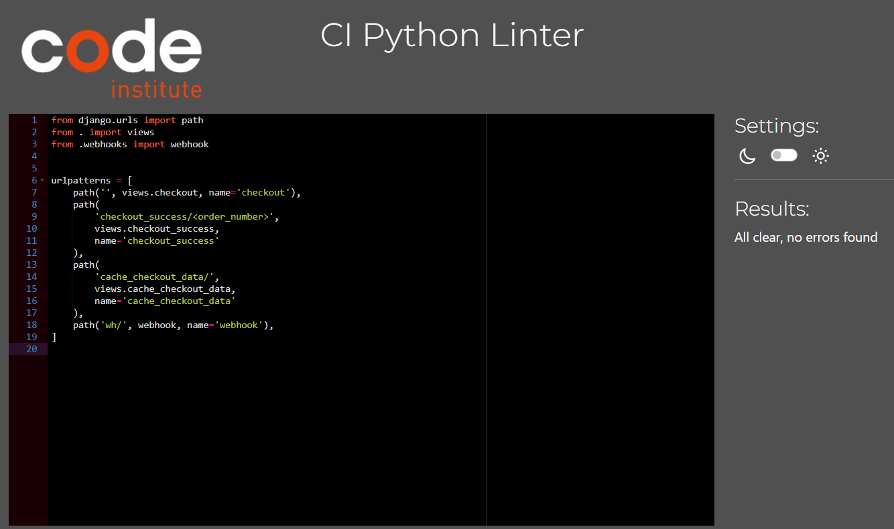
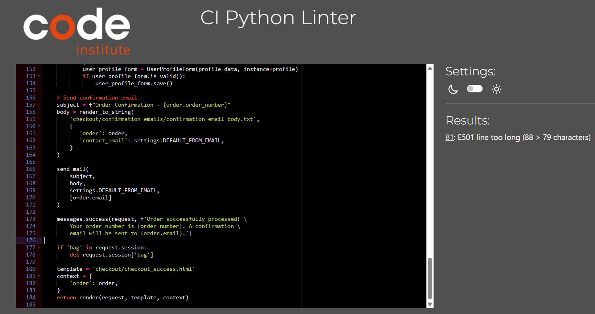
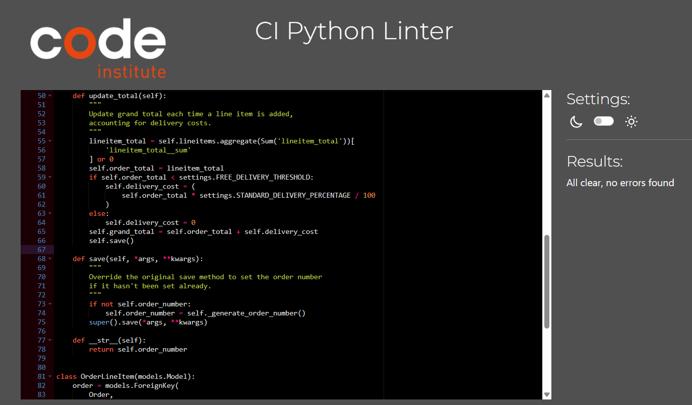

* Bag

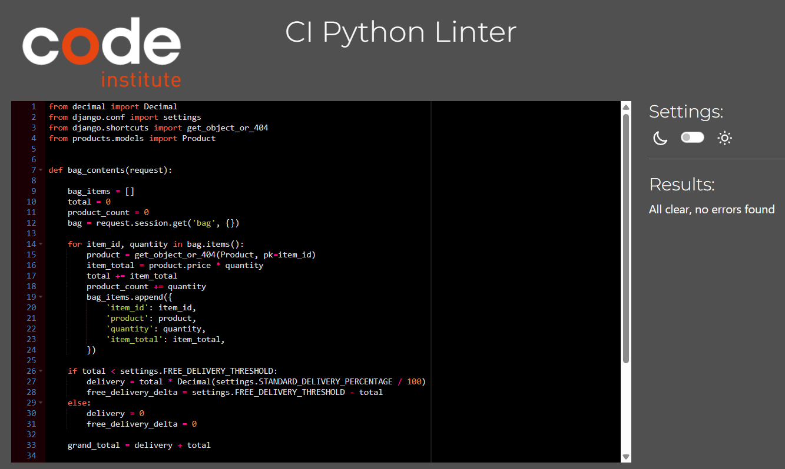
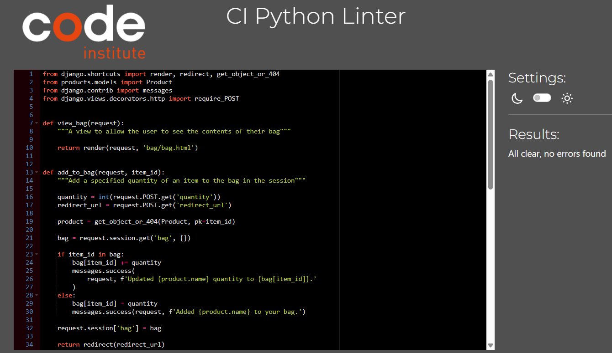

* Contac
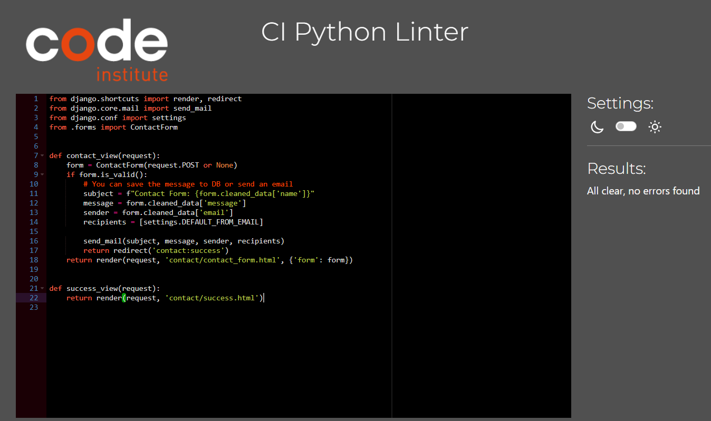

* Day Spell
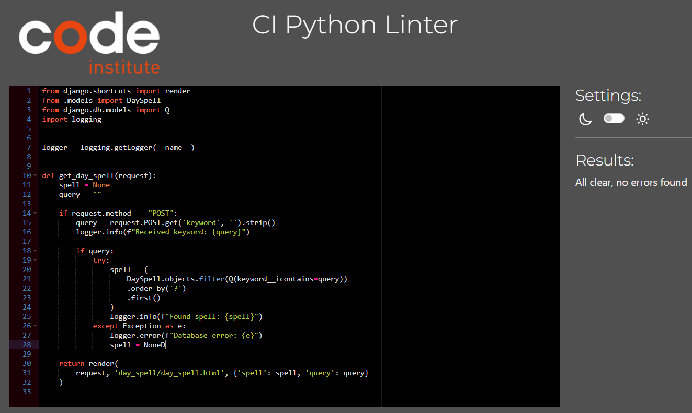

* Profile
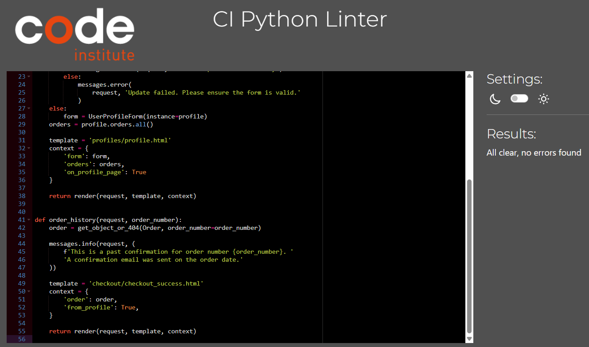
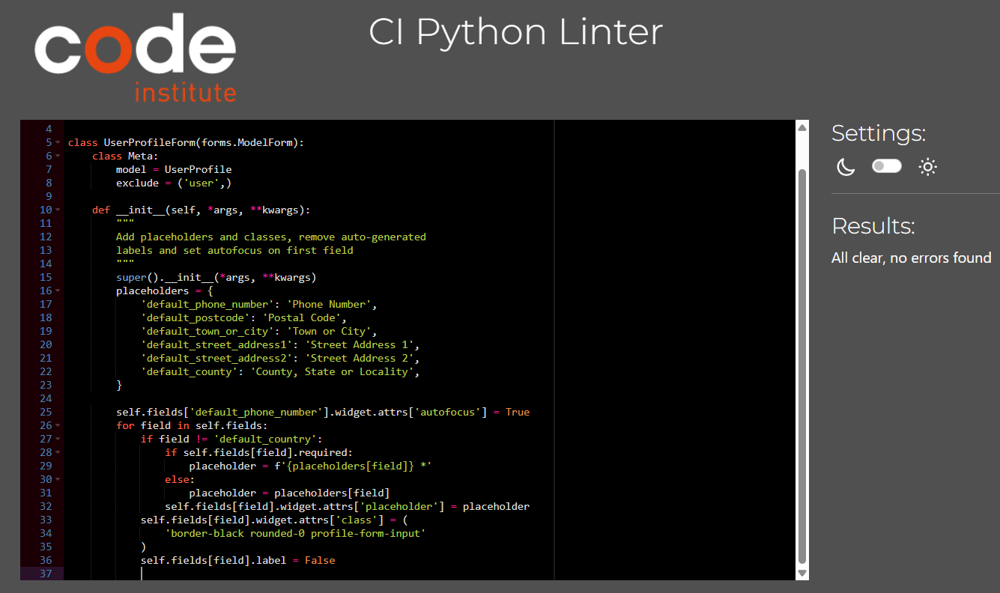
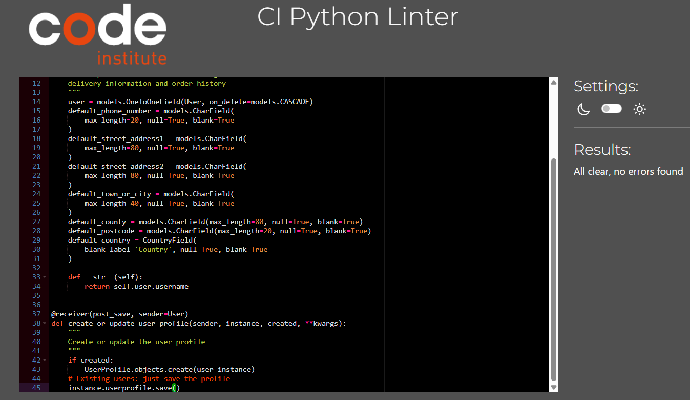

* Settings.py
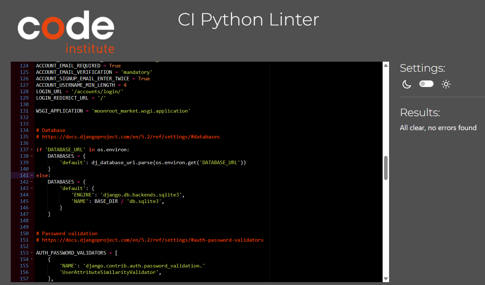

* Webhook
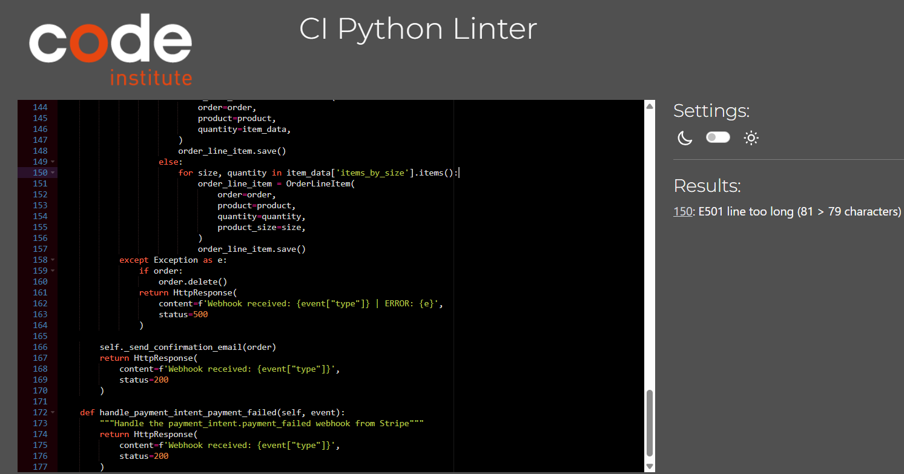
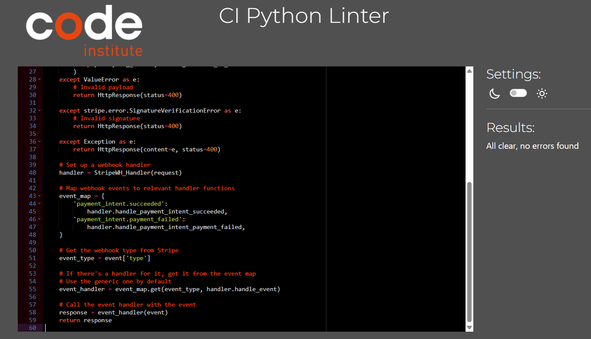


# Browser Compability

The site was tested across multiple browsers for consistency and responsiveness:

| Browser           | Result  |
|------------------|--------|
| 🌍 **Google Chrome**   |   |
| 🦊 **Mozilla Firefox** |  |
| 🎭 **Microsoft Edge**  |   |
|🏴‍☠️ **Opera**            |   |


The site maintains a **consistent design** and remains **fully responsive** across different browsers.


# Bug-Fix

## ⚠️ 1-Security Notice

During the initial setup of this project, the secret key was unintentionally committed to version control. To resolve this:

- The original app was deleted.
- A new app was created with the secret key securely managed using environment variables.
- The `env.py` file is included in `.gitignore` to prevent future accidental commits.

**Important:**  
Always ensure that sensitive information like API keys, secret tokens, and credentials are stored in environment variables and never committed to the repository.

## 2-Stripe Integration Fix – jQuery and Webhook Issue

## 🧩 Problem Summary

While integrating Stripe payments, the following issues were encountered:

- Stripe elements would **not load in the browser**.
- The `$` symbol (jQuery) was **not recognized**.
- The **terminal output appeared normal**, but the browser didn’t reflect that.
- After setting up the **webhook**, the page would **freeze on order submission**:
  - No success or error messages.
  - No output in the terminal or browser console.

## 🛠️ Initial Workaround

Wrapping the code in a **loop** provided a temporary fix by making the page responsive initially.

## ✅ Final Solution

### 🔍 Root Cause

The issue was caused by the browser **not properly reading the jQuery script**, likely due to the `integrity` attribute.

### ❌ Original jQuery Script (Not Working)

```html
<script src="https://code.jquery.com/jquery-3.7.1.min.js"
        integrity="sha384-JlY8zMqb6gci8CnmUHzbqUOdD3jZP2BfIWeUE5SrZT4TgZTrZnMzI+1SWSK+3z+s"
        crossorigin="anonymous"></script>
